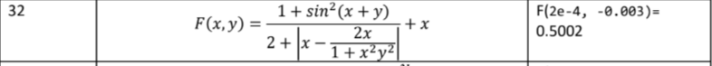

# Домашнее задание к работе 5
## Условие задачи  
Написать программу вычисления значения функции двух переменных. Результат проверить на контрольном примере.

## Информация о разработчике
### Чудакова Екатерина бИЦТ-261
